# HELEP Project Documentation

## 1. Introduction

This document summarizes the implementation, orchestration, CI/CD, monitoring, and evidence for the HELEP emergency response platform. It is written as the source content for the final Google Doc submission. Screenshot placeholders are included where visual evidence is useful, but the demo video will carry most of the runtime proof.

HELEP is implemented as five FastAPI microservices communicating through Apache Kafka. The platform allows citizens to register, trigger SOS incidents, cancel incidents, dispatch responders, send simulated notifications, and expose police/admin analytics.

## 2. Environment and Tooling

### Purpose

The project requires a Windows-compatible orchestration workflow using Docker, Kubernetes, Helm, Strimzi, Prometheus/Grafana, and Jenkins.

### Tools Used

| Tool | Purpose |
|------|---------|
| Docker Desktop | Builds and runs container images. |
| Minikube | Provides a local Kubernetes cluster. |
| kubectl | Interacts with Kubernetes. |
| Helm | Packages and deploys Kubernetes resources. |
| Strimzi | Runs Kafka inside Kubernetes. |
| Jenkins | Required CI/CD platform. |
| Prometheus/Grafana | Monitoring and metrics visualization. |
| Pandoc | Exports Markdown documents to PDF. |

### Verification Commands

PowerShell:

```powershell
docker --version
docker compose version
kubectl version --client=true
minikube version
helm version
git --version
```

Linux/macOS fallback:

```bash
docker --version
docker compose version
kubectl version --client=true
minikube version
helm version
git --version
```

### Evidence

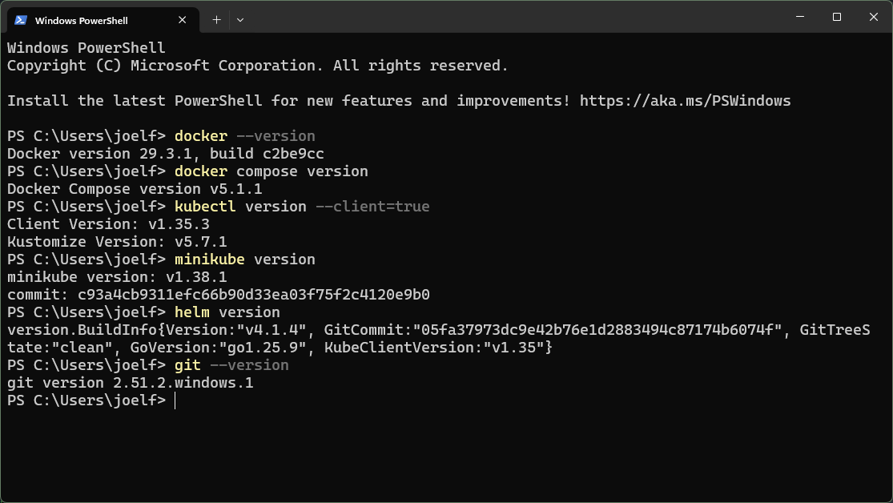

## 3. Baseline Docker Compose Smoke Test

### Purpose

Before Kubernetes packaging, the starter saga was tested locally with Docker Compose. This proved the application behavior worked before orchestration complexity was introduced.

### Commands

PowerShell:

```powershell
docker compose -f docker-compose.dev.yml up --build
```

Linux/macOS fallback:

```bash
docker compose -f docker-compose.dev.yml up --build
```

Signup request:

```powershell
$signup = Invoke-RestMethod `
  -Method Post `
  -Uri "http://localhost:8001/signup" `
  -ContentType "application/json" `
  -Body '{"phone":"+237600000001","password":"hunter22","role":"citizen"}'

$token = $signup.token
$signup
```

Linux/macOS fallback:

```bash
curl -X POST localhost:8001/signup \
  -H 'content-type: application/json' \
  -d '{"phone":"+237600000001","password":"hunter22","role":"citizen"}'
```

SOS request:

```powershell
$headers = @{ authorization = "Bearer $token" }

$sos = Invoke-RestMethod `
  -Method Post `
  -Uri "http://localhost:8002/sos" `
  -Headers $headers `
  -ContentType "application/json" `
  -Body '{"lat":4.0500,"lon":9.7700,"mode":"online"}'

$incidentId = $sos.incident_id
$sos
```

Analytics:

```powershell
Invoke-RestMethod -Uri "http://localhost:8005/stats/events"
Invoke-RestMethod -Uri "http://localhost:8005/stats/zones"
```

Linux/macOS fallback:

```bash
curl localhost:8005/stats/events
curl localhost:8005/stats/zones
```

### Expected Result

The signup endpoint returns an ID and JWT token. The SOS endpoint returns an `incident_id` and `ACTIVE` status. Analytics endpoints show event counts and zone statistics.

### Evidence
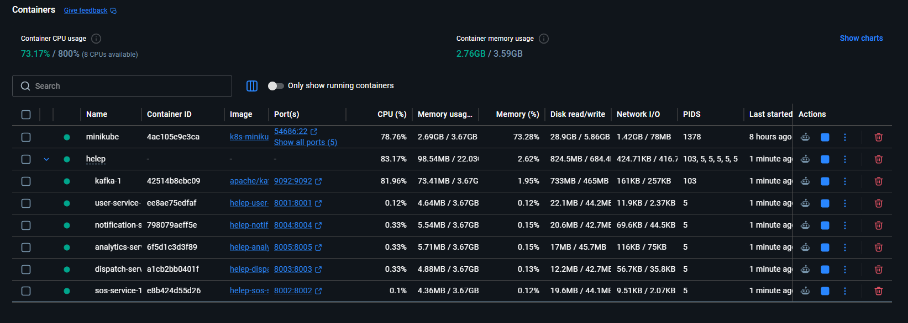

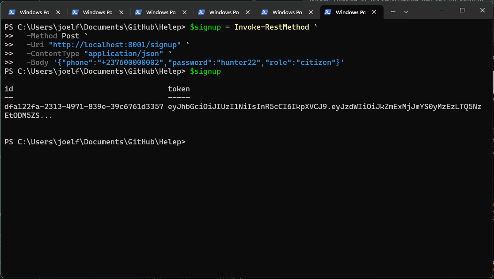

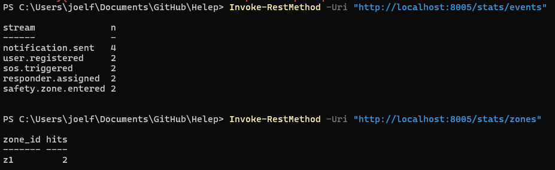

## 4. Code-Level Required Work

### Circuit Breaker

The circuit breaker was completed in each service's `app/events.py`. It prevents repeated Kafka publish attempts after failures and allows recovery after a timeout.

Key citation:

```text
services/user-service/app/events.py:60
services/user-service/app/events.py:67
services/user-service/app/events.py:78
services/user-service/app/events.py:87
```

### Third Strategy

A `RoundRobinMatcher` strategy was added to `dispatch-service/app/matching.py`.

Key citation:

```text
services/dispatch-service/app/matching.py:57
services/dispatch-service/app/matching.py:72
services/dispatch-service/app/matching.py:76
```

### Justification

The circuit breaker satisfies the required resilience pattern. The third strategy demonstrates that dispatch matching algorithms can vary without changing the dispatch event handler.

## 5. Containerization

### Purpose

Each service was given a Dockerfile so it can be independently built and deployed.

### Build Commands

PowerShell:

```powershell
docker build -t helep/user-service:dev services/user-service
docker build -t helep/sos-service:dev services/sos-service
docker build -t helep/dispatch-service:dev services/dispatch-service
docker build -t helep/notification-service:dev services/notification-service
docker build -t helep/analytics-service:dev services/analytics-service
docker images helep/*
```

Linux/macOS fallback:

```bash
docker build -t helep/user-service:dev services/user-service
docker build -t helep/sos-service:dev services/sos-service
docker build -t helep/dispatch-service:dev services/dispatch-service
docker build -t helep/notification-service:dev services/notification-service
docker build -t helep/analytics-service:dev services/analytics-service
docker images 'helep/*'
```

### Evidence

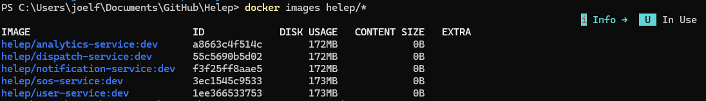

## 6. Kubernetes Cluster

### Purpose

Minikube provided a local Kubernetes cluster for deployment evidence.

### Commands

PowerShell:

```powershell
minikube start --driver=docker --cpus=2 --memory=4608
minikube addons enable ingress
minikube addons enable metrics-server
kubectl get nodes
```

Linux/macOS fallback:

```bash
minikube start --driver=docker --cpus=2 --memory=4608
minikube addons enable ingress
minikube addons enable metrics-server
kubectl get nodes
```

### Evidence

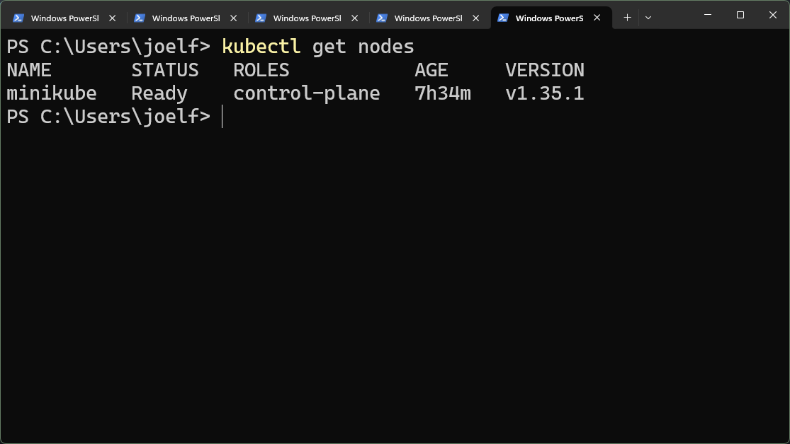

## 7. Strimzi Kafka Deployment

### Purpose

Kafka was deployed through Strimzi to satisfy the Kubernetes-native Kafka requirement.

### Commands

PowerShell:

```powershell
helm repo add strimzi https://strimzi.io/charts/
helm repo update
kubectl create namespace kafka
helm install strimzi-kafka-operator strimzi/strimzi-kafka-operator -n kafka
kubectl apply -f k8s/kafka/kafka.yaml
kubectl apply -f k8s/kafka/topics.yaml
kubectl get pods -n kafka
kubectl get kafkatopics -n kafka
```

Linux/macOS fallback:

```bash
helm repo add strimzi https://strimzi.io/charts/
helm repo update
kubectl create namespace kafka
helm install strimzi-kafka-operator strimzi/strimzi-kafka-operator -n kafka
kubectl apply -f k8s/kafka/kafka.yaml
kubectl apply -f k8s/kafka/topics.yaml
kubectl get pods -n kafka
kubectl get kafkatopics -n kafka
```

### Troubleshooting Performed

The Kafka broker initially entered `ImagePullBackOff` because Minikube failed to pull the Strimzi Kafka image from Quay due to a TLS handshake timeout. The image was manually pulled inside Minikube:

```powershell
minikube ssh -- docker pull quay.io/strimzi/kafka:1.0.0-kafka-4.2.0
kubectl delete pod helep-kafka-dual-role-0 -n kafka
```

Linux/macOS fallback:

```bash
minikube ssh -- docker pull quay.io/strimzi/kafka:1.0.0-kafka-4.2.0
kubectl delete pod helep-kafka-dual-role-0 -n kafka
```

### Final KafkaTopic Evidence

```text
NAME                  CLUSTER       PARTITIONS   REPLICATION FACTOR   READY
notification.sent     helep-kafka   3            1                    True
responder.assigned    helep-kafka   3            1                    True
responder.confirmed   helep-kafka   3            1                    True
safety.zone.entered   helep-kafka   3            1                    True
sos.cancelled         helep-kafka   3            1                    True
sos.triggered         helep-kafka   3            1                    True
user.registered       helep-kafka   3            1                    True
```

## 8. Helm and Kubernetes Deployment

### Purpose

The five services were packaged into a Helm umbrella chart under `charts/helep`.

### Resources Rendered

The chart renders:

- ConfigMap
- Secret
- PVCs
- Deployments
- Services
- HPAs
- Ingress
- NetworkPolicies
- Optional ServiceMonitor resources

### Commands

PowerShell:

```powershell
minikube -p minikube docker-env | Invoke-Expression

docker build -t helep/user-service:dev services/user-service
docker build -t helep/sos-service:dev services/sos-service
docker build -t helep/dispatch-service:dev services/dispatch-service
docker build -t helep/notification-service:dev services/notification-service
docker build -t helep/analytics-service:dev services/analytics-service

helm lint charts/helep
helm template helep charts/helep
helm upgrade --install helep charts/helep -n helep --create-namespace
```

Linux/macOS fallback:

```bash
eval "$(minikube -p minikube docker-env)"

docker build -t helep/user-service:dev services/user-service
docker build -t helep/sos-service:dev services/sos-service
docker build -t helep/dispatch-service:dev services/dispatch-service
docker build -t helep/notification-service:dev services/notification-service
docker build -t helep/analytics-service:dev services/analytics-service

helm lint charts/helep
helm template helep charts/helep
helm upgrade --install helep charts/helep -n helep --create-namespace
```

### Verification

```powershell
kubectl get pods -n helep
kubectl get svc -n helep
kubectl get deploy -n helep
kubectl get pvc -n helep
kubectl get hpa -n helep
kubectl get ingress -n helep
kubectl get networkpolicy -n helep
```

Linux/macOS fallback:

```bash
kubectl get pods -n helep
kubectl get svc -n helep
kubectl get deploy -n helep
kubectl get pvc -n helep
kubectl get hpa -n helep
kubectl get ingress -n helep
kubectl get networkpolicy -n helep
```

### Evidence

```text
[Screenshot: helm lint success]
[Screenshot: kubectl get pods -n helep]
[Screenshot: kubectl get hpa -n helep]
```

## 9. Kubernetes Smoke Test

### Purpose

The Kubernetes smoke test proves that the same end-to-end saga works after orchestration.

### Port Forwarding

PowerShell:

```powershell
kubectl port-forward -n helep svc/user-service 8001:8001
kubectl port-forward -n helep svc/sos-service 8002:8002
kubectl port-forward -n helep svc/analytics-service 8005:8005
```

Linux/macOS fallback:

```bash
kubectl port-forward -n helep svc/user-service 8001:8001
kubectl port-forward -n helep svc/sos-service 8002:8002
kubectl port-forward -n helep svc/analytics-service 8005:8005
```

### Test Commands

PowerShell:

```powershell
$signup = Invoke-RestMethod `
  -Method Post `
  -Uri "http://localhost:8001/signup" `
  -ContentType "application/json" `
  -Body '{"phone":"+237600000002","password":"hunter22","role":"citizen"}'

$token = $signup.token
$headers = @{ authorization = "Bearer $token" }

$sos = Invoke-RestMethod `
  -Method Post `
  -Uri "http://localhost:8002/sos" `
  -Headers $headers `
  -ContentType "application/json" `
  -Body '{"lat":4.0500,"lon":9.7700,"mode":"online"}'

Invoke-RestMethod -Uri "http://localhost:8005/stats/events"
Invoke-RestMethod -Uri "http://localhost:8005/stats/zones"
```

Linux/macOS fallback:

```bash
TOKEN=$(curl -s -X POST localhost:8001/signup \
  -H 'content-type: application/json' \
  -d '{"phone":"+237600000002","password":"hunter22","role":"citizen"}' | jq -r .token)

curl -X POST localhost:8002/sos \
  -H "authorization: Bearer $TOKEN" \
  -H 'content-type: application/json' \
  -d '{"lat":4.0500,"lon":9.7700,"mode":"online"}'

curl localhost:8005/stats/events
curl localhost:8005/stats/zones
```

### Logs

```powershell
kubectl logs -n helep deploy/dispatch-service
kubectl logs -n helep deploy/notification-service
kubectl logs -n helep deploy/analytics-service
```

Linux/macOS fallback:

```bash
kubectl logs -n helep deploy/dispatch-service
kubectl logs -n helep deploy/notification-service
kubectl logs -n helep deploy/analytics-service
```

## 10. Monitoring

### Purpose

The services expose Prometheus-compatible metrics through `/metrics`. A lightweight Prometheus/Grafana setup was used because the local machine has limited memory.

### Scrape Configuration

`prometheus-scrape.yaml` points Prometheus to all five service metrics endpoints:

```yaml
- job_name: helep-services
  metrics_path: /metrics
  static_configs:
    - targets:
        - user-service.helep.svc.cluster.local:8001
        - sos-service.helep.svc.cluster.local:8002
        - dispatch-service.helep.svc.cluster.local:8003
        - notification-service.helep.svc.cluster.local:8004
        - analytics-service.helep.svc.cluster.local:8005
```

### Commands

PowerShell:

```powershell
helm repo add prometheus-community https://prometheus-community.github.io/helm-charts
helm repo add grafana https://grafana.github.io/helm-charts
helm repo update
kubectl create namespace monitoring

helm upgrade --install prometheus prometheus-community/prometheus `
  -n monitoring `
  --set alertmanager.enabled=false `
  --set prometheus-pushgateway.enabled=false `
  --set kube-state-metrics.enabled=false `
  --set prometheus-node-exporter.enabled=false `
  --set server.persistentVolume.enabled=false `
  --set server.resources.requests.memory=256Mi `
  --set server.resources.requests.cpu=100m `
  --set server.resources.limits.memory=512Mi `
  --set server.resources.limits.cpu=500m `
  --set-file extraScrapeConfigs=prometheus-scrape.yaml

helm upgrade --install grafana grafana/grafana `
  -n monitoring `
  --set persistence.enabled=false `
  --set resources.requests.memory=128Mi `
  --set resources.requests.cpu=50m `
  --set resources.limits.memory=256Mi `
  --set resources.limits.cpu=300m `
  --set adminPassword=admin123
```

Linux/macOS fallback:

```bash
helm repo add prometheus-community https://prometheus-community.github.io/helm-charts
helm repo add grafana https://grafana.github.io/helm-charts
helm repo update
kubectl create namespace monitoring

helm upgrade --install prometheus prometheus-community/prometheus \
  -n monitoring \
  --set alertmanager.enabled=false \
  --set prometheus-pushgateway.enabled=false \
  --set kube-state-metrics.enabled=false \
  --set prometheus-node-exporter.enabled=false \
  --set server.persistentVolume.enabled=false \
  --set server.resources.requests.memory=256Mi \
  --set server.resources.requests.cpu=100m \
  --set server.resources.limits.memory=512Mi \
  --set server.resources.limits.cpu=500m \
  --set-file extraScrapeConfigs=prometheus-scrape.yaml

helm upgrade --install grafana grafana/grafana \
  -n monitoring \
  --set persistence.enabled=false \
  --set resources.requests.memory=128Mi \
  --set resources.requests.cpu=50m \
  --set resources.limits.memory=256Mi \
  --set resources.limits.cpu=300m \
  --set adminPassword=admin123
```

### Access

```powershell
kubectl port-forward -n monitoring svc/prometheus-server 9090:80
kubectl port-forward -n monitoring svc/grafana 3000:80
```

Linux/macOS fallback:

```bash
kubectl port-forward -n monitoring svc/prometheus-server 9090:80
kubectl port-forward -n monitoring svc/grafana 3000:80
```

Grafana login:

```text
username: admin
password: admin123
```

Prometheus data source URL in Grafana:

```text
http://prometheus-server.monitoring.svc.cluster.local
```

### Evidence

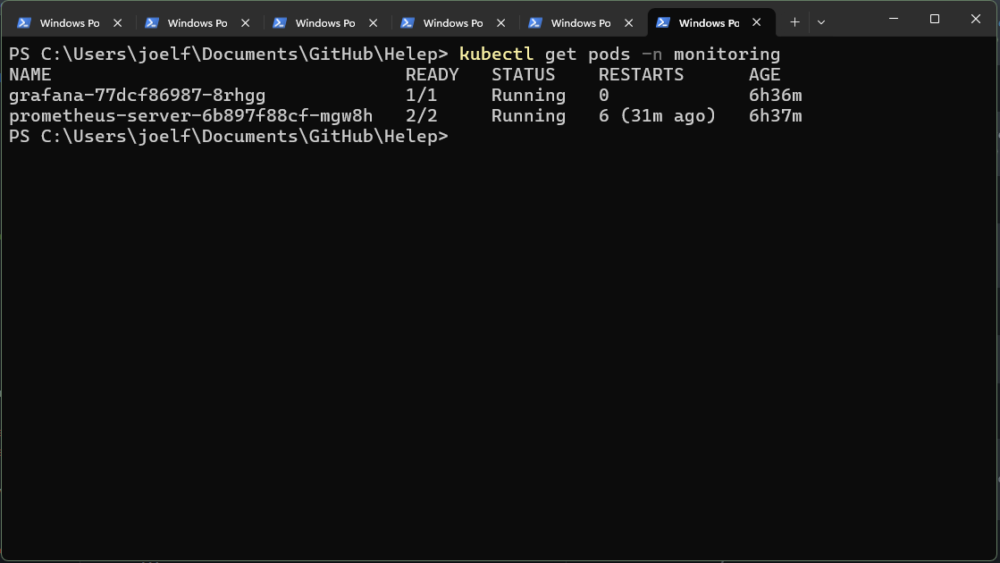

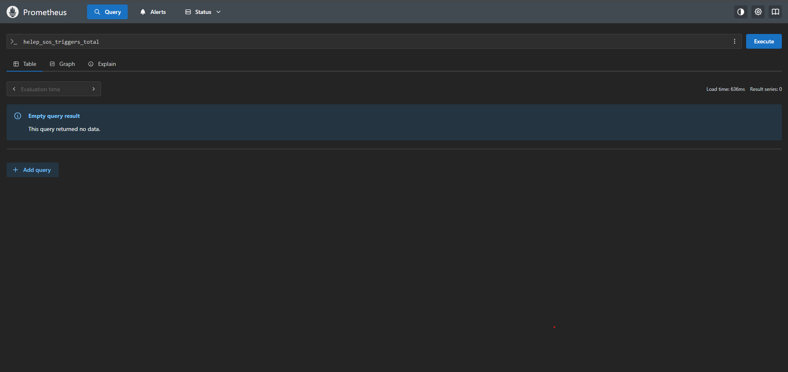

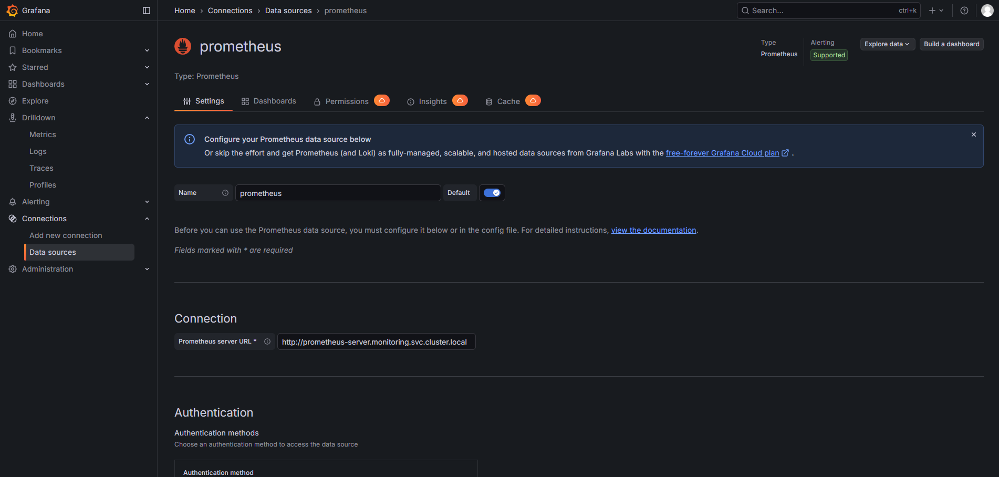

## 11. Jenkins CI/CD

### Purpose

The project mandates Jenkins for CI/CD. Jenkins validates the repository when changes are pushed to `main`.

### Jenkins Configuration

Repository:

```text
https://github.com/Joel-Fah/Helep.git
```

Branch:

```text
*/main
```

Build trigger:

```text
Poll SCM: H/2 * * * *
```

Credentials:

```text
None required for the public repository clone.
```

### Pipeline Stages

The Jenkinsfile defines:

- Tool Versions
- Python Syntax Checks
- Docker Build
- Helm Validate
- Optional Minikube Deploy

Key citations:

```text
Jenkinsfile:4
Jenkinsfile:21
Jenkinsfile:31
Jenkinsfile:41
Jenkinsfile:51
Jenkinsfile:58
```

### Successful Jenkins Evidence

The successful pipeline was triggered by a code change and completed with:

```text
HELEP CI pipeline completed successfully.
Finished: SUCCESS
```

It validated:

- Git version
- Docker version
- kubectl version
- Helm version
- Dockerized Python syntax checks
- Docker builds for all five services
- Helm lint
- Helm template

### Evidence
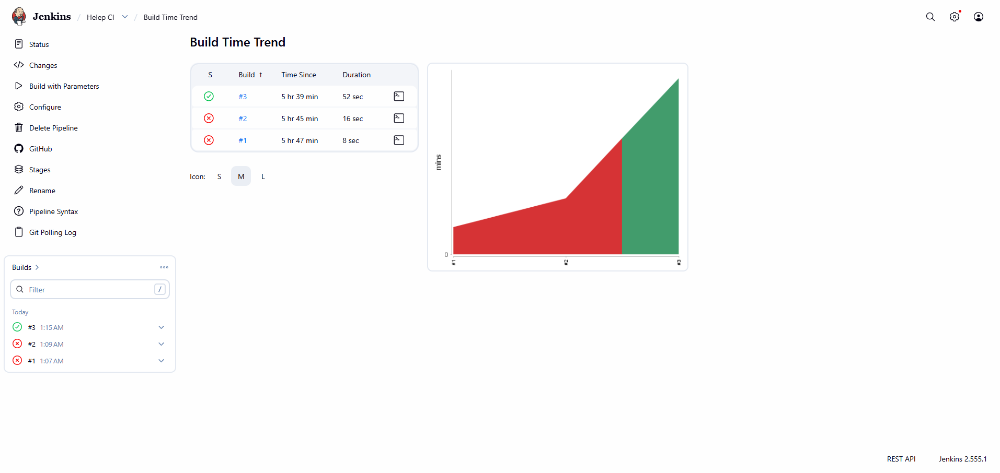


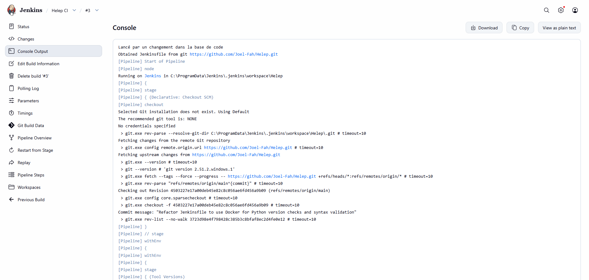

## 12. Local Resource Constraint Note

The local machine has approximately 8 GB RAM. The initial Kubernetes allocation was too small for Kafka, five microservices, and monitoring together, causing API server timeouts. The practical mitigation was to use a staged demo approach:

1. Run Kafka and HELEP core services first.
2. Capture core saga evidence.
3. Add lightweight monitoring only after core evidence is captured.
4. Prefer `/metrics` endpoint proof if Grafana becomes unstable.

This is a realistic orchestration lesson: observability stacks and Kafka are resource-hungry, so local development clusters must be sized and staged carefully.

## 13. Final Artifacts

| Artifact | Purpose |
|----------|---------|
| `Dockerfile` per service | Container build definition. |
| `k8s/kafka/kafka.yaml` | Strimzi Kafka cluster definition. |
| `k8s/kafka/topics.yaml` | KafkaTopic definitions. |
| `charts/helep` | Helm chart for all services. |
| `prometheus-scrape.yaml` | Lightweight Prometheus scrape config. |
| `Jenkinsfile` | Jenkins CI/CD pipeline. |
| `design-process.md` / `design-process.pdf` | L4 design process document. |
| `patterns.md` / `patterns.pdf` | L3 patterns-in-code document. |
| Demo video | Runtime proof of the system. |

## 14. Conclusion

The HELEP project demonstrates a complete microservices orchestration workflow: containerized FastAPI services, event-driven Kafka communication, Kubernetes deployment through Helm, Strimzi-managed Kafka, monitoring with Prometheus/Grafana, and Jenkins-based CI/CD. The implementation preserves the emergency-response invariants through event keying, idempotency checks, repository boundaries, and isolated consumer groups.
